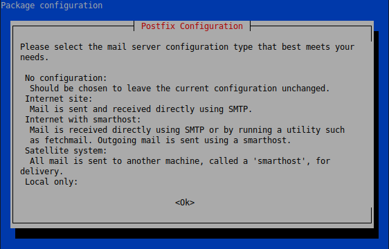
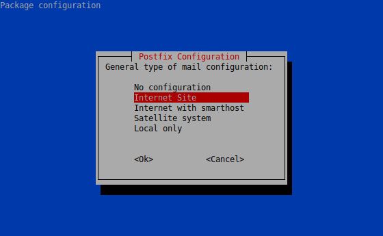
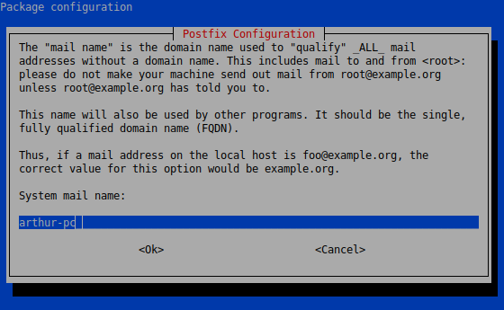
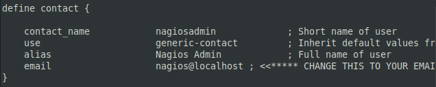
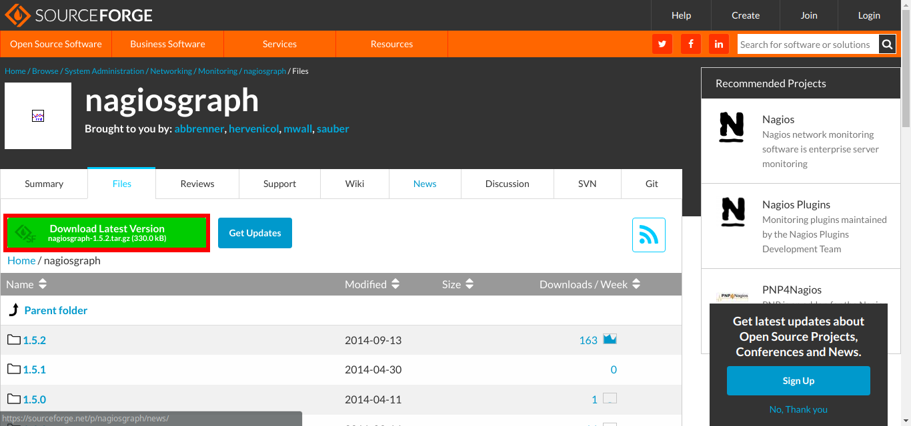
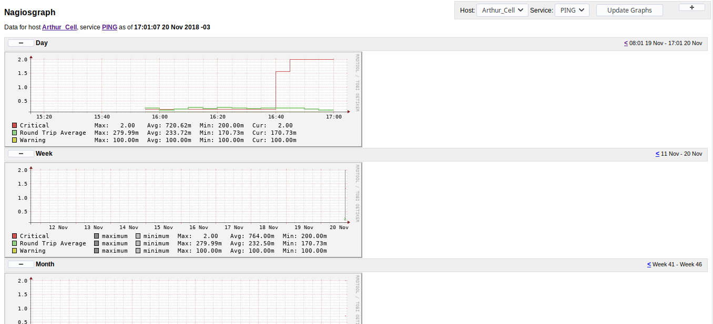
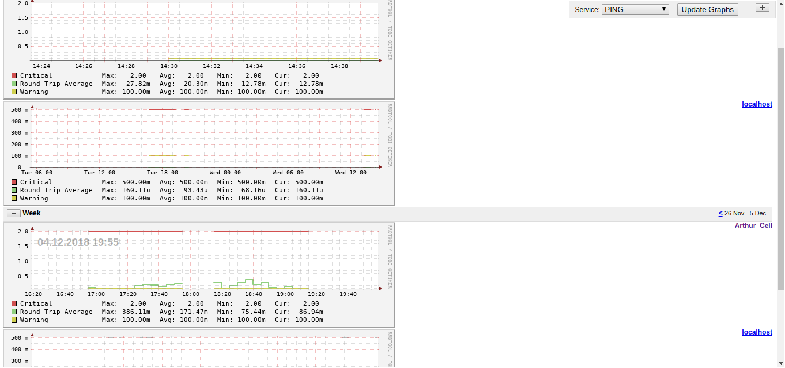

# Redes-Naggios-Shop

**Ferramenta de monitoramento que enviará alertas via email ao detectar falhas na redefd geração de relatórios de erros e monitoração do fluxo de conexões.**

**Nessa documentação iremos mostrar passo a passo da execução dos seguintes tópicos:**

- **Instalação e configuração do Nagios**
-  **Monitoramento dos dispositivos da rede**
- **Alertas de erros via e-mail**
- **Nagiosgraph**
- **Adicionais**
    - **Instalação e configuração do banco de dados PostgreSQL**
    - **Habilitar o projeto Spring (Java)**

## Pré requisitos:
Para seguir esta documentação é necessario possuir o Ubuntu 16.04 LTS instalado, seja em uma maquina fisica ou em uma maquina virtual como o Oracle VM Virtual Box.

Links Úteis: 
[Como instalar o Ubuntu na Virtual Box](https://www.techtudo.com.br/dicas-e-tutoriais/noticia/2016/04/como-instalar-o-ubuntu-com-o-virtualbox.html)

## Nagios
### SELinux
Este guia leva em cosideração que o SELinux está desativado, pois esta é a configuração padrão do Ubuntu. Se deseja saber se está instalado, execute o comando:
```bash
sudo dpkg -l selinux*    
```
### Pré-requisitos
Execute o comando a seguir para atualizar os pacotes instalados e instalar os pré-requisitos:
```bash
sudo apt-get update
sudo apt-get install -y autoconf gcc libc6 make wget unzip apache2 php libapache2-mod-php7.0 libgd2-xpm-dev
```
### Baixe o arquivo fonte
Execute os comandos a seguir criar a pasta onde o Nagios vai ser instalado, navegar para dita pasta, baixar o arquivo compactado do Nagios e extrai os arquivos compactados.

```bash
mkdir /home/<usuario>/nagios 
cd /home/<usuario>/nagios 
wget -O nagioscore.tar.gz https://github.com/NagiosEnterprises/nagioscore/archive/nagios-4.4.1.tar.gz  
tar xzf nagioscore.tar.gz
```
 
 ### Compile o Nagios
 Rode os seguintes comandos para poder instalar o Nagios
```bash
cd /home/user/nagios/nagioscore-nagios-4.4.1
sudo ./configure --with-httpd-conf=/etc/apache2/sites-enabled
sudo make all
```
 
###  Crie o primeiro usuário e o grupo
Esses comandos irão o usuário e o grupo *nagios*. O usuário *www-data* também será adicionado para o grupo *nagios*
```bash
sudo make install-groups-users
sudo usermod -a -G nagios www-data
```
### Instalação dos arquivos binários
Este comando irá instalar os arquivos binários, CGIs e arquivos HTML.
```bash
sudo make install
```
### Instalação do Daemon
Este comando irá instalar o serviço e irá configurar o Nagios para iniciar ao ligar o dispositivo
```bash
sudo make install-daemoninit
```
### Instalação do modo de comando
Este comando irá instalar e configurar o arquivo que permite execução de comandos externamente
```bash
sudo make install-commandmode
```
### Instalação dos arquivos de configuração
Este comando irá instalar os arquivos padrão de configuração do Nagios. O Nagios precisa destes arquivos para poder iniciar o serviço.
```bash
sudo make install-config
```
### Instalação dos arquivos de configuração do Apache
Estes comandos instalaram os arquivos de configuração do servidor web do Apache e as configurações do Apache
```bash
sudo make install-webconf
sudo a2enmod rewrite
sudo a2enmod cgi
```

### Configuração do firewall
Também é preciso permitir a entrada de tráfego pela porta 80 para que se possa acessar a interface web do Nagios.
```bash
sudo ufw allow Apache
sudo ufw reload
``` 

### Criação do usuário admin
Este comando irá criar um usuário Apache para o acesso ao Nagios. Ele criará o usuário chamado *nagiosadmin* e pedirá a inserção da senha

```bash

sudo htpasswd -c /usr/local/nagios/etc/htpasswd.users nagiosadmin 

```

### Inicialização do Apache e do Daemon
Estes comando irão inicializar o Apache e o Daemon

```bash

sudo systemctl apache2.service restart
sudo systemctl nagios.service start

```

### Instalação dos plugins básicos

```bash

cd /usr/local/src
sudo wget https://nagios-plugins.org/download/nagios-plugins-2.2.1.tar.gz#_ga=2.103818373.400631121.1541798172-414053869.1541798172
sudo tar zxvf nagios-plugins-2.2.1.tar.gz
sudo ./configure --with-nagios-user=nagios --with-nagios-group=nagios
sudo make
sudo make install

```

Agora você pode acessar o nagios clicando [aqui](http://localhost/nagios) ou digitando localhost/nagios no seu navegador

## Monitoramento
Após a instalação completa do nagios é necessario preparar a estrutura dos arquivos que iremos utilizar:

```bash
cd /usr/local/nagios/etc
sudo mkdir network // Pasta onde colocaremos os hosts de rede que iremos mapear.
sudo mkdir windows // Pasta onde colocaremos os hosts windowns.
sudo mkdir linux   // Pasta onde colocaremos os hosts linux.
```
Em seguida é necessario criar um template onde contém o padrão de configuração para cada tipo de host (Windown, Linux ou Rede Network):

```bash

cd /usr/local/nagios/etc
sudo vi templateNP.cfg

```
E colar o seguinte script no templateNP.cfg:

```
### Template "SERVICOS" de Rede e ICMP 

define service{
    name 					TemplateService 
    active_checks_enabled 			1 
    notifications_enabled 			1 
    passive_checks_enabled 			0 
    retain_status_information 		1 
    is_volatile 				0 
    max_check_attempts 			3 
    check_interval 				5 
    normal_check_interval 			5 
    retry_check_interval 			5 
    check_period 				24x7 
    notification_interval 			0 
    notification_period 			24x7 ; 24hrs / 7 dias da semana
    notification_options 			u,c,r ; U = Unknown C = Critical R = Recovery
    register 				0 
} 

#### Template "HOST" Windows 


define host{ 
    name 					TemplateHostWindows 
    max_check_attempts 			3 
    check_interval 				5 
    retry_check_interval 			5 
    active_checks_enabled 			1 
    passive_checks_enabled 			0 
    check_period 				24x7 
    retain_status_information 		1 
    notification_interval 			60 ; Tempo de intervalo entre o envio do alerta
    notification_period 			24x7 
    notification_options 			d,u,r ; D = Down U = Unknowm R = Recovery
    register 				0 
} 

### Template "HOST" Linux 

define host{ 
    name 					TemplateHostLinux 
    check_command 				check-host-alive
    max_check_attempts 			3 
    check_interval 				5 
    retry_check_interval 			5 
    active_checks_enabled 			1 
    check_period 				24x7 
    retain_status_information 		1 
    notification_interval 			60 
    notification_period 			24x7 
    notification_options 			d,u,r 
} 

### Template "HOST" Rede 

define host{ 
    name 					TemplateHostRede 
    check_command 				check-host-alive 
    max_check_attempts 			2 
    check_interval 				5 
    retry_check_interval 			5 
    active_checks_enabled 			1 
    check_period 				24x7 
    retain_status_information 		1 
    notification_interval 			60 
    notification_period 			24x7 
    notification_options 			d,u,r 
} 

# definicao do comando 'check_tcp'
define command {
    command_name check_tcpNP
    command_line $USER1$/check_tcp -H $HOSTADDRESS$ -p $ARG1$ -w $ARG2$ -c $ARG3$
}
```

Após criarmos as pastas e o arquivo citado acima, é necessário referência-los no arquivo principal do nagios, o nagios.cfg, colando o comando abaixo logo após a linha 18 do arquivo:

```bash

cfg_dir=/usr/local/nagios/etc/linux
cfg_dir=/usr/local/nagios/etc/windows
cfg_dir=/usr/local/nagios/etc/network
cfg_file=/usr/local/nagios/etc/templatesNP.cfg

```

Agora iremos testar o funcionamento do nagios mapeando um site, nesse caso o site www.terra.com, para isso criaremos um arquivo cfg dentro da pasta network que criamos anteriormente

```bash
cd /usr/local/nagios/etc
sudo vi terra_site.cfg

```

E colocaremos o seguinte script dentro do arquivo recém criado:

```
# Definindo o host

define host { 
    host_name Terra_Site 
    use TemplateHostRede ; Referenciando ao template que criamos acima 
    alias Site do Terra ; Apelido
    address www.terra.com ; Endereço/IP
    contact_groups admins ; Padrão Nagios
} 

# Definindo os serviços que iremos monitorar

define service { 
    use TemplateService 
    host_name Terra_Site ; Deve ser o mesmo nome do host acima
    service_description PING-Disponibilidade ; Descrição do Serviço a ser monitorado
    check_command check_ping!3000.0,80%!5000.0,100%!; Plugin e Parametros;
    contact_groups admins 
}

define service { 
    use TemplateService 
    host_name Terra_Site
    service_description HTTP
    check_command check_tcpNP!80!1!2! 
    contact_groups admins 
}
```
Com isso adicionamos um host com 2 serviços que iremos mapear, para visualizar o host é necessario reiniciar o serviço do nagios e logo em seguida acessar o portal do nagios clicando [aqui](http://localhost/nagios) ou digitando localhost/nagios no seu navegador e clicar em hosts.

Comando para reiniciar o servico do nagios:

```bash
sudo systemctl nagios.service restart
```

## Alertas

### Instalação do Postfix

Para conseguir realizar alertas via email utilizando o Nagios é preciso instalar o `Postfix` para configuracao do servidor de email e o mailutils para enviar os emails.

Para instalar o Postfix basta executar o comando:

```bash
sudo apt-get install Postfix
```

Após o download dos arquivos será aberta a seguinte janela de configuração do `Postfix`



Selecione a opção `OK` para continuar e a segunda tela de instalação será aberta. Nesta janela selecione a opção `Internet Site` (ou `Site da internet` depedendo do idioma do sua máquina)



A próxima tela é a de definição do nome de seu sistema de email, para este projeto o nome definido automaticamente será usado.



E pronto! Aguarde a finalização da instalação do Postfix para continuar para o próximo passo.

### Criação de conta no Sendgrid

Neste projeto utilizaremos da plataforma `Sendgrid` para o envio de emails. Para criar a conta no Sendgrid basta clicar [aqui](https://sendgrid.com/pricing/) para acessar a pagina de cadastro


Utilizaremos a versão gratuita do Sendgrid neste projeto. Para continuar abaixe um pouco a página e a opção `try for free` irá aparecer. Clique nela para continuar para a ultima página do cadastro


Para terminar basta preencher os campos com suas informações e marcar a caixa confirmando que o usuário não é um bot e a outra caixa aceitando os termos de serviço e clicando no botão `Create Account`


Agora vamos para a configuração do `Postfix`

### Configuração do Postfix

Para configurar o Postfix primeiramente encontre o arquivo de configuração do Postfix, comumente localizada na pasta `/etc/postfix/main.cf`, e adicionar os seguintes parâmetros:

```
smtp_sasl_auth_enable = yes
smtp_sasl_password_maps = hash:/etc/postfix/sasl_passwd
smtp_sasl_security_options = noanonymous
smtp_sasl_tls_security_options = noanonymous
smtp_tls_security_level = encrypt
header_size_limit = 4096000
relayhost = [smtp.sendgrid.net]:587
```

Agora você precisa escrever a suas credenciais do Sendgrid para o Postfix poder mandar os emails. É preciso criar um arquivo para conter essas informações. O arquivo deve estar localizado no caminho pela variável `stmp_sasl_password_maps`.
Seu arquivo deve conter suas informações no seguinte formato:

```
[smtp.sendgrid.net]:587 <usuario>:<senha>
```

Preencha os campos `usuario` e `senha` com as suas credenciais do Sendgrid.

Agora utilize o comando `postmap` para atualizar a tabela de senhas do postfix no arquivo criado.

```bash
sudo postmap /etc/postfix/contasendgrid
```

E para finalizar, reinicie o Postfix:

```bash
sudo systemctl restart postfix
```

### Instalação do mailutils

O Postfix é a biblioteca para configuração do servidor de email, mas para mandar o email será utilizado o pacote `mailutils`. Para instalar execute o comando:

```bash
sudo apt-get install mailutils
```

Para testar se a configuração está correta execute o comando:

```bash
echo "Email de teste" | mail -s "Teste" <email>
```

O comando irá enviar um email com o corpo `Email de teste` e com assunto `Teste` para o email preenchido.

### Configuração do Nagios para enviar emails

Abra o arquivo de contatos do nagios com o comando:

```bash
sudo mousepad /usr/local/nagios/etc/objects/contacts.cfg
```

Agora encontre o contato com o nome `nagiosadmin`



E mude o valor de email para o seu nome de usuario do Sendgrid.

Para finalizar teste se as suas configurações estão corretas com o comando:

```
sudo /usr/local/nagios/bin/nagios -v /usr/local/nagios/etc/nagios.cfg
```

E reinicie o Nagios com o comando:

```bash
sudo systemctl restart nagios.service
```

## Nagiosgraph

### Instalação do nagiosgraph

Para baixar os arquivos necessários clique [aqui](https://sourceforge.net/projects/nagiosgraph/files/nagiosgraph/) para acessar a página do `nagiosgraph`. Em seguida clique em `Download Latest Version`para baixar os arquivos compactados. 



Execute o comando abaixo para extrair os arquivos do nagiosgraph e mudar o diretório atual do terminal

```bash
tar -zxf nagiosgraph-1.5.2.tar.gz
cd nagiosgraph-1.5.2
```

O seguinte como irá checar se todas as dependências já estão instaladas.

```bash
./install.pl --check-prereq
```

O comando irá lançar uma saída neste formato

```bash
checking required PERL modules
  Carp...1.42
  CGI...4.38
  Data::Dumper...2.167
  Digest::MD5...2.55
  File::Basename...2.85
  File::Find...1.34
  MIME::Base64...3.15
  POSIX...1.76
  RRDs...1.5001
  Time::HiRes...1.9741
checking optional PERL modules
  GD...2.69
  Nagios::Config...36
checking nagios installation
  found nagios exectuable at /usr/local/nagios/bin/nagios
checking web server installation
  found apache executable at /usr/sbin/apache2
  found apache init script at /etc/init.d/apache2
```

Caso as dependências RRDs, GD e Nagios::Config estejam faltando execute os seguintes comandos
```bash
sudo apt-get install librrds-perl libgd-gd2-perl
perl -MCPAN -e shell
install Nagios::Config
exit
```

Se todas as dependencias já estiverem instaladas execute o comando abaixo para realizar a instalação:
```bash
./install.pl --layout standalone --prefix /usr/local/nagiosgraph
```

Serão apresentadas várias opções para configuração do `nagiosgraph` durante a instalação mas não é preciso realizar alterações nos valores padrões, com exceção das seguintes opções

```bash
Modify the Nagios configuration? [n] y
Path of Nagios configuration file? /usr/local/nagios/etc/nagios.cfg
Path of Nagios commands file? /usr/local/nagios/etc/objects/commands.cfg 
Modify the Apache configuration? [n] y
Path of Apache configuration directory? /etc/apache2
```

Agora deve-se reiniciar o Nagios e o Apache

### Configurando o Nagios com o nagiosgraph

As seguintes configurações devem ser adicionadas ao arquivo `nagios.cfg` na pasta `/usr/local/nagios/etc`

```
process_performance_data=1
service_perfdata_file=/tmp/perfdata.log
service_perfdata_file_template=$LASTSERVICECHECK$||$HOSTNAME$||$SERVICEDESC$||$SERVICEOUTPUT$||$SERVICEPERFDATA$
service_perfdata_file_mode=a
service_perfdata_file_processing_interval=15
service_perfdata_file_processing_command=process-service-perfdata-for-nagiosgraph
```

Também deve-se adicionar o seguinte comando no arquivo de comandos do Nagios, localizado em `/usr/local/nagios/etc/objects/commands.cfg`

```
define command {
  command_name process-service-perfdata-for-nagiosgraph
  command_line /usr/local/nagiosgraph/bin/insert.pl
}
```

Para finalizar a configuração modifique o arquivo de configuração do Apache inserindo a seguinte linha no final do arquivo

```
Include /usr/local/nagiosgraph/etc/nagiosgraph-apache.conf
```

O arquivo de configuração do Apache está localizado `/etc/apache2/apache2.conf`

### Adicionando o serviço do nagiosgraph

Primeiro deve-se criar o serviço do `nagiosgraph` adicionando as definições abaixo no arquivo `/usr/local/nagios/etc/objects/templates.cfg`

```
define service {
    name nagiosgraph
    action_url /nagiosgraph/cgi-bin/show.cgi?host=$HOSTNAME$&service=$SERVICEDESC$
    register 0
}
```

Agora já é possivel utilizar o `nagiosgraph` para obter os gráficos. Basta adicionar o nagiosgraph no campo `use`

```
define service {
    use generic-service,nagiosgraph
    host_name Arthur_Cell
    service_description PING
    check_command check_ping!100,10%!2000,20%
}
```

Isto pode ser feito para todos os serviços em que se deseja obter gráficos baseados nos dados obtidos.

Segue alguns dos gráficos obtidos




## Adicionais

## PostgreSQL

### Instalação

Os repositórios padrão do Ubuntu contém os pacotes do Postgres, assim podemos instalá-lo facilmente utilizando o sistema de pacotes `apt`

```bash
sudo apt-get update
sudo apt-get install postgresql postgresql-contrib
```

O procedimento de instalação criou um usuário chamado  `postgres`  que é associado com o role padrão do Postgres. Para usar o Postgres, podemos fazer login nessa conta

Alterne para a conta  `postgres`  no seu servidor digitando:

```bash
sudo -i -u postgres
```

Agora você pode acessar o prompt do Postgres imediatamente digitando:

```bash
psql
```

### Configuração:

Apos a instalação é necessario criar um banco de dados chamado "ecommerce" e alterar a senha do usuario postgres para "redes123" com os seguintes comandos:

```bash
psql -U postgres
create database ecommerce
alter user postgres with encrypted password <suasenha>;
```

## Projeto Spring

### Instalação do Java JDK 8 no Ubuntu:
Primeiro é necessario adicionar o PPA (Personal Package Archives) da Oracle e logo em seguida atualizar o repositorio de pacotes e realizar a instalação :
```bash 
sudo add-apt-repository ppa:webupd8team/java
sudo apt-get update
sudo apt-get install oracle-java8-installer
java -version
```
Se tudo ocorrer bem ao executar o comando será mostrada a versão do Maven instalada:
     
### Instalação Maven
Primeiro é necessario pegar o pacote do Maven disponivel com o comando abaixo:
```bash 
sudo apt-cache search maven
``` 
Logo em seguida executar o comando abaixo para instalar a ultima versão do Apache Maven e apos a execução. 

```bash
sudo apt-get install maven
```

Se tudo ocorrer bem ao executar o comando abaixo será mostrada a versão do Maven instalada:

```bash
mvn -version
```

### Execução do Projeto
        
O projeto deverá ser baixado do nosso repositorio do [Github](https://github.com/DoisLucas/Redes-Nagios-Shop)  
    
Com o terminal aberto é necessario navegar até a pasta do projeto que foi baixado e executar o seguinte comando para subir a aplicação:

```bash 
mvn spring-boot:run
```
